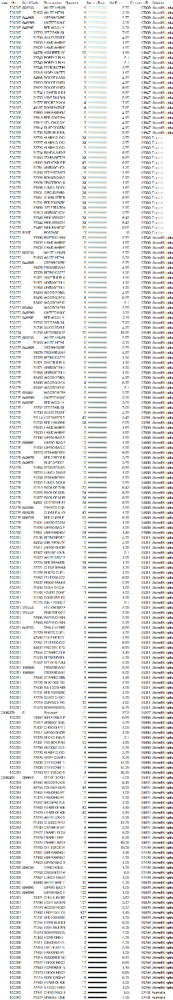

# 1. Análisis Inicial y Normalización Manual

A continuación se presenta el análisis de los tres conjuntos de datos originales ubicados en `data/raw/`, detallando los registros anómalos encontrados, la justificación teórica de sus violaciones a las reglas de normalización y el procedimiento manual para llevarlos a la Tercera Forma Normal (3FN).

---

## Dataset 1: E-commerce Sales (data.csv)

### Evidencia de Datos Desnormalizados

### Identificación de 5 Registros Anómalos
* **Registro 1:** En la fila 2, para el `InvoiceNo` 536365, se encontró en la columna `Description` el valor "WHITE METAL LANTERN" ligado al `StockCode` 71053, y en la columna `Country` el valor "United Kingdom" ligado al `CustomerID` 17850.
* **Registro 2:** En la fila 3, para el `InvoiceNo` 536365, se encontró en la columna `Description` el valor "CREAM CUPID HEARTS COAT HANGER" ligado al `StockCode` 84406B. Se repite el cliente y el país.
* **Registro 3:** En la fila 4, para el `InvoiceNo` 536365, se encontró en la columna `Description` el valor "KNITTED UNION FLAG HOT WATER BOTTLE" ligado al `StockCode` 84029G. Se repite el cliente y el país.
* **Registro 4:** En la fila 5, para el `InvoiceNo` 536365, se encontró en la columna `Description` el valor "RED WOOLLY HOTTIE WHITE HEART." ligado al `StockCode` 84029E. Se repite el cliente y el país.
* **Registro 5:** En la fila 6, para el `InvoiceNo` 536365, se encontró en la columna `Description` el valor "SET 7 BABUSHKA NESTING BOXES" ligado al `StockCode` 22752. Se repite el cliente y el país.

### Justificación de Violación a Formas Normales
Estos datos violan la **Segunda Forma Normal (2FN)** y la **Tercera Forma Normal (3FN)**. 
* **Violación 2FN:** La descripción del producto (`Description`) depende únicamente del código del producto (`StockCode`), no de la llave primaria compuesta de la transacción (Número de factura + Código de producto).
* **Violación 3FN:** El país (`Country`) depende del cliente (`CustomerID`), no de la factura. Esto genera una dependencia transitiva (Factura -> Cliente -> País), provocando redundancia masiva cada vez que el mismo cliente compra.

### Paso a Paso Manual para Arreglarlo
1. **Separar Productos (2FN):** Crear una tabla `products` con `StockCode` como llave primaria (PK) y mover allí la columna `Description`. Eliminar `Description` de la tabla principal.
2. **Separar Clientes (3FN):** Crear una tabla `customers` con `customer_id` como PK y mover allí la columna `Country`.
3. **Crear Cabecera de Factura:** Crear la tabla `invoices` con `invoice_no` como PK, dejando solo `invoice_date` y el `customer_id` como llave foránea (FK).
4. **Crear Detalles de Transacción:** Dejar la tabla restante como `invoice_details` que conecte `invoice_no` (FK), `stock_code` (FK), `Quantity` y `UnitPrice`.

---

## Dataset 2: Hospital Patient Records (dataset.csv)

### Evidencia de Datos Desnormalizados

### Identificación de 5 Registros Anómalos
* **Registro 1:** En la fila 2, columna `encounter_id` 114252, se encontró esto: Los atributos `age` (77.0), `gender` (F) y `ethnicity` (Caucasian) se registran repitiendo la información intrínseca del `patient_id` 59342.
* **Registro 2:** En la fila 3, columna `encounter_id` 119783, se encontró esto: Los atributos `age` (25.0), `gender` (F) y `bmi` (31.95) se repiten para el `patient_id` 50777.
* **Registro 3:** En la fila 4, columna `encounter_id` 79267, se encontró esto: Los atributos `age` (81.0), `gender` (F) y `height` (165.1) se repiten para el `patient_id` 46918.
* **Registro 4:** En la fila 5, columna `encounter_id` 92056, se encontró esto: Los atributos `age` (19.0) y `gender` (M) se repiten para el `patient_id` 34377.
* **Registro 5:** En la fila 6, columna `encounter_id` 33181, se encontró esto: Los atributos `age` (67.0) y `gender` (M) se repiten para el `patient_id` 74489.

### Justificación de Violación a Formas Normales
Este dataset viola la **Tercera Forma Normal (3FN)** al mezclar entidades lógicas distintas en una sola "sábana" de datos transaccionales, creando dependencias transitivas. Los datos antropométricos y demográficos (edad, género, peso, altura) dependen del paciente, no del encuentro médico. Si el paciente ingresa 5 veces al hospital, sus datos físicos se escribirán 5 veces.

### Paso a Paso Manual para Arreglarlo
1. **Aislar Pacientes (3FN):** Crear una tabla fuerte `patients` usando `patient_id` como PK. Mover todas las columnas demográficas y físicas (`age`, `bmi`, `ethnicity`, `gender`, `height`, `weight`) a esta tabla.
2. **Aislar Unidades Médicas (3FN):** Crear la tabla `icus` con `icu_id` como PK y mover los datos de la unidad (`hospital_id`, `icu_type`).
3. **Limpiar Transacciones:** Mantener la tabla `encounters` con `encounter_id` como PK. Sustituir todos los datos removidos en los pasos 1 y 2 por simples llaves foráneas (`patient_id` y `icu_id`), conservando solo los datos del evento (`elective_surgery`, `icu_admit_source`, etc.).

---

## Dataset 3: Netflix Movies and TV Shows (netflix.csv)

### Evidencia de Datos Desnormalizados

### Identificación de 5 Registros Anómalos
* **Registro 1:** En la fila 2, columna `cast` del `show_id` s2, se encontró esto: "Ama Qamata, Khosi Ngema, Gail Mabalane, Thabang Molaba...". Múltiples actores en una sola celda.
* **Registro 2:** En la fila 3, columna `cast` del `show_id` s3, se encontró esto: "Sami Bouajila, Tracy Gotoas, Samuel Jouy...".
* **Registro 3:** En la fila 5, columna `cast` del `show_id` s5, se encontró esto: "Mayur More, Jitendra Kumar, Ranjan Raj...".
* **Registro 4:** En la fila 6, columna `cast` del `show_id` s6, se encontró esto: "Kate Siegel, Zach Gilford, Hamish Linklater...".
* **Registro 5:** En la fila 8, columna `cast` del `show_id` s8, se encontró esto: "Kofi Ghanaba, Oyafunmike Ogunlano, Edogo Mak...".

### Justificación de Violación a Formas Normales
Este documento viola fuertemente la **Primera Forma Normal (1FN)**. La regla cardinal de la 1FN es la atomicidad: cada intersección de fila y columna debe contener un solo valor, no listas. Al tener un arreglo de nombres separados por comas, el motor de base de datos no puede indexar, buscar, ni relacionar actores o directores de forma eficiente.

### Paso a Paso Manual para Arreglarlo
1. **Garantizar Atomicidad (1FN):** Conceptualmente, se debe "explotar" la fila. Si un show tiene 5 actores, se deben crear 5 filas para ese show, cada una con un actor distinto.
2. **Evitar Redundancia (2FN/3FN):** Para no repetir el título del show 5 veces, se extraen los catálogos. Se crean las tablas fuertes `directors`, `actors`, `countries` y `genres` asignándoles un ID único (PK).
3. **Crear Tablas Puente (Relación M:N):** La tabla `shows` se queda solo con atributos de la película. Se crean tablas intermedias (`show_actor`, `show_director`, etc.) que unan el `show_id` con el `actor_id`, logrando relacionar múltiples actores con múltiples películas sin guardar listas de texto.
